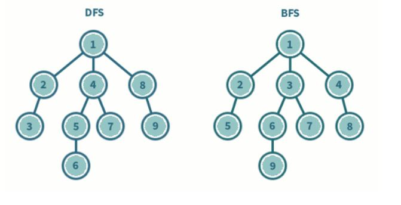

# Algorithm_Tip

**목차**  

[1. 인접 행렬 vs 인접 리스트](#인접-행렬-vs-인접-리스트)
[2. StringTokenizer](#stringtokenizer)
[3. 동적계획법](#동적계획법)

## **알고리즘 분석에 사용하는 대표적인 세 가지 점근적 표기법**

모든 알고리즘 점근적 표기법은 &isin; 대신 = 을 사용한다. 따라서 "표기법 = 점근식" 처럼 사용하면 안된다. "표기법 &isin; 점근식" 이 아니기 때문이다.

점근적 표기법은 입력의 크기가 충분히 큰 경우에 대한 분석이다.

### 1. &theta;-표기법
&theta;(f<sub>(n)</sub>)은 점근적 증가율이 f(n)과 일치하는 모든 함수의 집합이다.

## **재귀**

많은 알고리즘 문제들이 재귀 호출로 풀면 쉽게 풀리는 경우가 있다. 또한 다른 알고리즘 풀이 방법들도 내부적으로 재귀를 호출해 사용하는 것들도 있으니 알아두어야 한다.

재귀는 문제의 특성에 따라 코딩을 훨씬 간편하게 해 줄 수 있다.

### ex1) 중첩 반복문 대체하기

0번부터 차례대로 번호 매겨진 n개의 원소 중 4개를 고르는 모든 경우
ex) n=7이라면, (0,1,2,3), (0,1,2,4), (0,1,2,5), ..., (3,4,5,6)의 경우의 수

```
for(int i=0; i<n; ++i)
    for(int j=i+1; j<n; ++i)
        for(int k=j+1; k<n; ++i)
            for(int l=k+1; l<n; ++i)
                System.out.println(i+" "+j+" "+k+" "+l);
```

5개를 골라야 하는 경우는 5단 중첩문을 사용하면 된다.
6개를 골라야 하는 경우는 6단 중첩문을 사용해야 한다.
이처럼 골라야 하는 원소 수가 증가하면 코드가 길고 복잡해진다. 또한 입력(원소의 수)에 따라 달라질 수 있는 경우에는 사용할 수 없는 코드가 된다.

재귀호출은 이런 경우에 단순한 반복문보다 간결하고 유연한 코드를 작성할 수 있도록 해준다.

위 코드 조각이 하는 작업은 크게 네 개의 조각으로 나눌 수 있다.(각 코드 조각에서 각각 하나의 원소를 고르는 작업) 그러면 이 작업은 하나의 원소를 고르고 남은 원소들을 고르는 작업을 자신을 호출해 떠넘기는 재귀 함수를 작성가능하다. 이때, 남은 원소들을 고르는 작업을 다음과 같은 입력들의 집합으로 정의할 수 있다.

1. 원소들의 총 개수
2. 더 골라야 할 원소들의 개수
3. 지금까지 고른 원소들의 번호

```
// n : 전체 원소의 수
// picked : 지금까지 고른 원소들의 번호
// toPick: 더 고를 원소의 수
// 일때, 앞으로 toPick개의 원소를 고르는 모든 방법을 출력한다.
void pick(int n, int[] picked, int toPick){
    // 기저사례 : 더 고를 원소가 없을 때 고른 원소들을 출력
    if(toPick==0) { printPicked(picked); return;}
    // 고를 수 잇는 가장 작은 번호 계산
    int smallest = picked.empty() ? 0 : picked.back() + 1;
    // 이 단계에서 원소 하나를 고른다.
    for(int next = smallest; next<n; ++next){
        picked.push_back(next);
        pick(n,picked,topick-1);
        picked.pop_back();
    }
}
```

### **재귀 함수의 조건**

1. 모든 재귀함수는 '더이상 쪼개지지 않는' 최소한의 작업에 도달했을 때 답을 곧장 반환하는 조건문을 포함해야 한다. 즉, 기저 사례(base case)를 포함해야한다.


## **정렬**

정렬의 경우 정렬하고자 하는 개체의 수가 입력의 크기가 된다.

## **StringTokenizer**

자바에서 String을 Token 단위로 끊어주는 기능 제공 

## **DFS 알고리즘**

DFS 알고리즘은 깊이 우선 탐색으로 아래 그림처럼 깊이를 우선적으로 탐색하는 방법이다.



**개념**

- 루트 노드에서 시작해서 다음 분기로 넘어가기 전에 해당 분기를 완벽하게 탐색하는 방법
- 미로를 탐색할 때 한 방향으로 갈 수 있을 때까지 가다가 더 이상 갈 수 없게 되면 다시 가장 가까운 갈림길로 돌아와서 다시 탐색을 진행하는 방법과 유사
- 모든 노드를 방문하고자 하는 경우에 이 방법을 선택

**깊이 우선 탐색 특징**
1. 자기 자신을 호출하는 순환 알고리즘의 형태를 지님
2. 그래프 탐색의 경우 어떤 노드를 방문 했었는지 여부를 반드시 검사해야 한다.(하지 않을 경우 무한루프에 빠질 위험이 있음)

DFS는 스택을 사용하고, 인접행렬 또는 인접리스트를 통해 구현할 수 있다.

### 인접행렬 vs 인접 리스트 (그래프 표현 방법)

인접 행렬은 연결 되어 있지 않은 간선도 표시하기 때문에, 차지하는 크기가 크다. 따라서, 입력의 꼭짓점(vertex)가 적은 경우에 인접 행렬을 사용, 많으면 인접 리스트를 사용한다.

혹은, 인접 리스트를 통해 간선에 대한 접근을 하려면 각 인덱스를 순회하여야 하므로 상황에 따라 선택하여 쓴다.

### 스택

사용하는 연산
1. push : 저장소에 자료를 삽입
2. pop : 저장소에서 자료를 꺼냄
3. isEmpty : 스택이 공백인지 아닌지 확인
4. peek : top에 있는 원소를 반환

### 스택의 알고리즘

1. push

    ```
    int Stack[100];
    int Top = -1;

    void push(int val){
        if(top >= 100(STACK_SIZE)-1) // Stack size 확인
            return; // Overflow
        else
            Stack[++Top] = val; // 값 추가
    }
    ```

2. pop
   
   ```
    int pop() {
        if(Top==-1) // Stack이 비었는 지 확인
            return 0;   // Empty
        else
            return Stack[Top--];
    }

### **DFS 알고리즘-재귀**

Input 사이즈가 작다면 재귀로 풀어도 된다.(주로 많이 쓰는 방법)

```
int Graph[MAX_N][MAX_M];
bool Visited[MAX_N]; // 방문 한 적이 있는 지 확인

// 재귀 형식으로 깊이 탐색이 들어가게 된다. 0->1->2 순으로 만약 없다면, 재귀가 끝나 되돌아 가게된다.
void dfs(int node){
    Visited[node] = true; // 방문 했으니 변경

    for(int next=0; next<N; ++next){
        if(!Visited[next] && Graph[node][next]) // 한 번도 가보지 않았고, 길이 있다면, 재귀 수행
            dfs(next);
    }
}
```

### **DFS 알고리즘-반복**

Input  사이즈가 큰 경우, 즉 방문해야 할 노드가 많다면 재귀 call 프레임이 많아 스택 사이즈가 넘어가는 StackOverFlow가 발생 할 수 있다.

```
int Graph[MAX_N][MAX_M];
int Stack[STACK_SIZE], Top;

// node : 시작 정점
void dfs(int node){
    bool Visited[MAX_N] = {false}; // 방문 한 적이 있는 지 확인
    Top = -1;   // 스택 Top 초기화

    Stack[++Top]=node;  // 데이터 추가 (시작 정점 먼저 들릴테니 마지막에 추가)

    while(Top != -1){   // 원소가 남아있다면
        int curr = Stack[Top--]; 마지막으로 저장된 원소를 하나 꺼냄 == pop
        if(!visited[curr]){ // 방문한 적이 없다면
            visited[curr] = true;
            
            for(int next=0; next<N; ++next){
        if(!Visited[next] && Graph[curr][next]) // 한 번도 가보지 않았고, 길이 있다면, 스택에 추가
            Stack[++Top] = next;
    }
        }
    }
}
```
## **BFS 알고리즘**

너비 우선 탐색은 탐색 시작점의 인접한 정점들을 먼저 모두 차례로 방문한 후에 방문 했던 정점을 시작점으로 해서 다시 인접한 정점을 차례로 방문하는 형식

인접한 정점들에 대해 탐색한 후, 차례로 다시 너비탐색을 진행해야 하므로, 선입선출의 큐를 이용

DFS 알고리즘은 깊이 우선 탐색으로 아래 그림처럼 깊이를 우선적으로 탐색하는 방법이다.


**개념**

- 루트 노드에서 시작해서 인접한 노드를 먼저 탐색하는 방법
- 시작 정점으로부터 가까운 정점을 먼저 방문하고 멀리 떨어져 있는 정점을 나중에 방문하는 순회 방법
- 두 노드 사이의 최단 경로 혹은 임의의 경로를 찾고 싶을 때 이 방법을 선택함

**깊이 우선 탐색 특징**
1. BFS는 재귀적으로 동작하지 않는다.
2. 그래프 탐색의 경우 어떤 노드를 방문 했었는지 여부를 반드시 검사해야한다.(검사하지 않으면 무한 루프에 빠질 위험)
3. 방문한 노드들을 차례로 저장한 후 꺼낼 수 있는 큐를 사용

### 큐

사용하는 연산
1. enqueue : Rear(꼬리)에 데이터 삽입
2. dequeue : front(머리)에 데이터 삭제
3. Rear : 큐의 꼬리 부분, 저장된 원소 중 마지막 원소
4. front : 큐의 머리 부분, 저장된 원소 중 첫 번째 원소


## **동적계획법**

### 정의

1. 복자한 문제를 간단한 여러 문제로 나누어 푸는 방법
2. 점화식 도출
3. 메모이제이션
