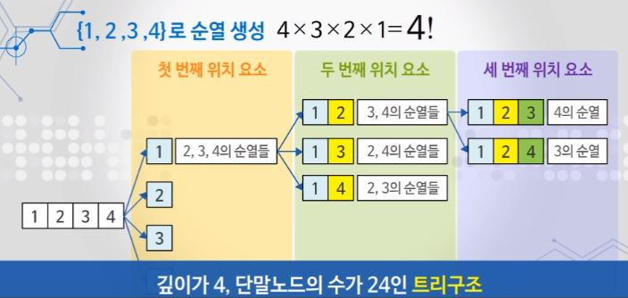
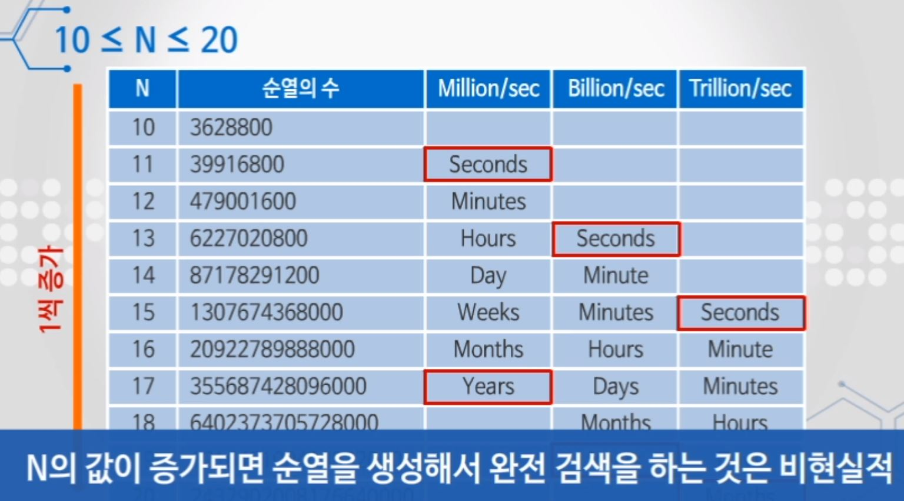
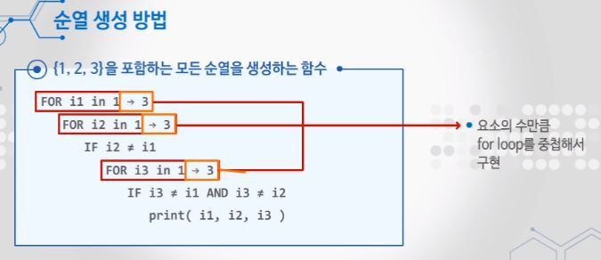
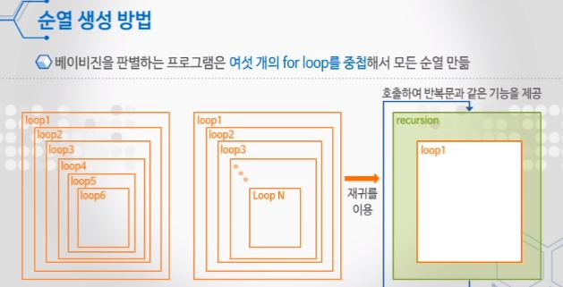
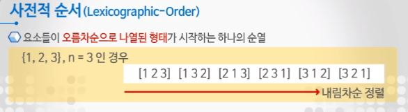
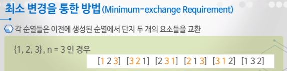
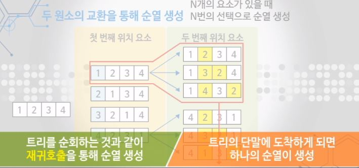

# 순열

## 순열이란?   
- 완전 검색의 조합적 문제 유형 중 하나
- 서로 다른 것들 중 몇 개를 뽑아서 한 줄로 나열
- 다수 문제들이 순서화된 요소들의 집합에서 최선의 경우를 찾는 것  
    (ex) 각 도시를 한 번씩 방문하고 출발 도시로 돌아오는 최소 비용 경로는?)
- nPr = n * (n-1) * (n-2) * ... * (n-r+1) = n!
    
---
## 순열의 시간

완전 검색의 특성 상 n의 개수가 늘어나면 시간이 기하급수적으로 증가한다.  
순열의 시간 복잡도는 팩토리얼에 비례하여 폭발적으로 증가한다.

---
## 순열 생성 방법  

요소의 수 만큼 for loop를 중첩 (각 루프에서 n번째 요소를 정함) -> 요소의 수가 고정되지 않으면 어려움 -> **재귀호출을 필요한 만큼 반복**

1. 사전적 순서(Lexicographic-Order)
   - 요소들이 오름차순으로 나열된 형태가 시작하는 하나의 순열
    
    

2. 최소 변경을 통한 방법(Minimum-exchange Requirement)
   - 각 순열들은 이전에 생성된 순열에서 단지 두 개의 요소들을 교환
    
    
    
--- 
## 순열이 사용되는 문제

- 순회 외판원 문제  
  : 각 도시를 한 번씩 방문하고 출발 도시로 돌아오는 최소 비용 경로는?
- 존슨 트로터 알고리즘 문제  
  : 최소 변경을 통한 방법 문제로 교환되는 두 요소를 순서대로 표시하면 일정한 패턴을 생성한다.
